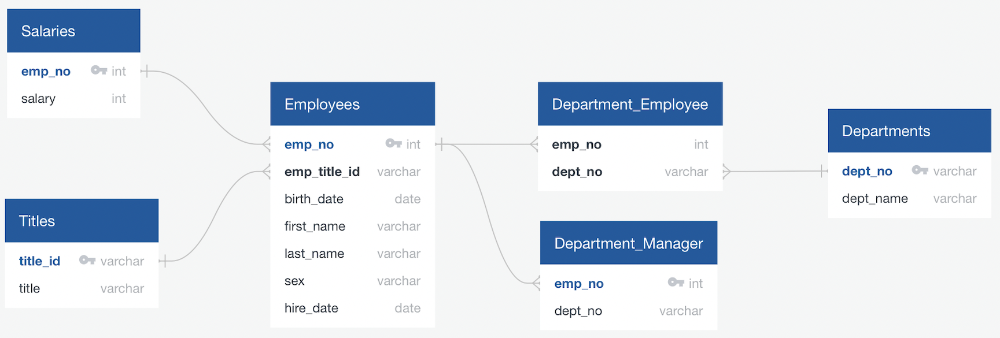

# SQL Challenge

Analyse Pewlett Hackard (a fictional company) employees from the 1980s and 1990s using PostgreSQL!

Created and submitted for an assignment for Monash University Data Analytics Boot Camp (July 2023).

## Table of Contents

- [General info](#general-info)
- [Technologies](#technologies)
- [Screenshot](#screenshot)
- [Code example](#code-example)
- [References](#references)

## General info

### ph_table_schemata.sql

- Creates tables containing the necessary columns, primary and foreign keys.  
- Imports data from six CSV files.

### ph_queries.sql

- Queries data from all six tables.
- Uses JOIN, WHERE, LIKE, GROUP BY, ORDER BY and aggregate functions.

## Technologies

Project created and run using:

- pgAdmin 4 version 7.2
- QuickDatabaseDiagrams.com

## Screenshot

#### Entity Relationship Diagram



## Code example

```sql
--Code Snippet from ph_queries.sql

/* DATA ANALYSIS */

/* 1. List the employee number, last name, first name, sex, and salary of each employee. */
SELECT E.emp_no, E.last_name, E.first_name, E.sex, S.salary
FROM Employees as E
INNER JOIN Salaries AS S ON E.emp_no = S.emp_no;

/* 2. List the first name, last name, and hire date for the employees who were hired in 1986. */
SELECT first_name, last_name, hire_date
FROM Employees
WHERE hire_date BETWEEN '1986-01-01' AND '1986-12-31';

/* 3. List the manager of each department along with their department number, department name, employee number, last name, and first name. */
SELECT  D.dept_name, Dept_M.emp_no, E.last_name, E.first_name, D.dept_no
FROM Department_Manager AS Dept_M
INNER JOIN Employees AS E ON Dept_M.emp_no = E.emp_no
INNER JOIN Departments AS D ON Dept_m.dept_no = D.dept_no
ORDER BY D.dept_name;

/* 4. List the department number for each employee along with that employee’s employee number, last name, first name, and department name. */
SELECT Dept_E.dept_no, Dept_E.emp_no, E.last_name, E.first_name, D.dept_name
FROM Department_Employee AS Dept_E
INNER JOIN Employees AS E ON Dept_E.emp_no = E.emp_no
INNER JOIN Departments as D ON Dept_e.dept_no = D.dept_no;

/* 5. List the first name, last name, and sex of each employee whose first name is Hercules and whose last name begins with the letter B. */
SELECT first_name, last_name, sex
FROM Employees
	WHERE first_name = 'Hercules' 
	AND last_name LIKE 'B%';
  
/* 6. List each employee in the Sales department, including their employee number, last name, and first name. */
SELECT E.emp_no, E.last_name, E.first_name   
FROM Employees AS E
INNER JOIN Department_Employee AS Dept_E ON E.emp_no = Dept_E.emp_no
INNER JOIN Departments as D ON Dept_E.dept_no = D.dept_no
	WHERE D.dept_name = 'Sales';
```

## References

- Code, in general, was adapted from Monash University Data Analytics Boot Camp 2023 course learning material.


Created and written by Samuel Palframan - July 2023.
